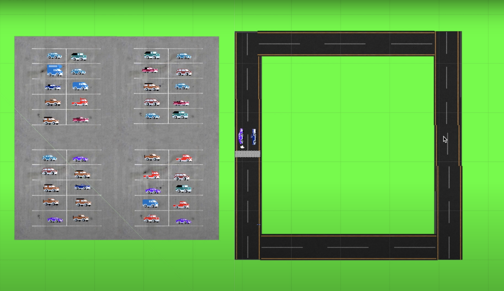
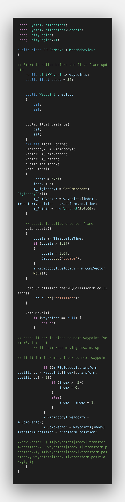
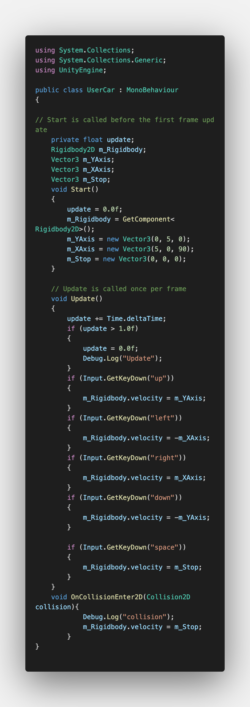
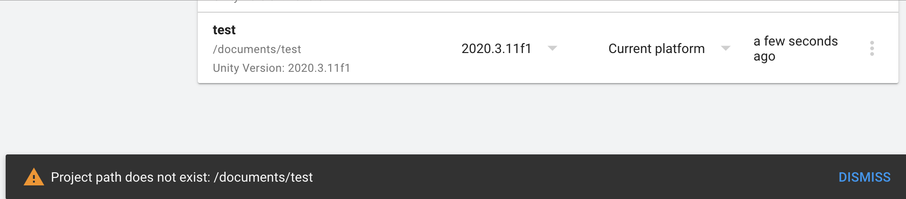

# 2D Car Racing Game in Unity
I worked on a 2D Car Racing Game in Unity using Csharpe. Basically, there are two cars: the car controlled by the user and the CPU car. They race continuously; If the user car wins, the race resets, and the user gets a point, but if the CPU car wins, the game ends, and the user's final score is the number of points they have.

| **Engineer** | **School** | **Area of Interest** | **Grade** |
|:--:|:--:|:--:|:--:|
| Sidarth R | Irvington High School | Engineering | Incoming Junior

  
# Final Milestone
My final milestone is the increased reliability and accuracy of my robot. I ameliorated the sagging and fixed the reliability of the finger. As discussed in my second milestone, the arm sags because of weight. I put in a block of wood at the base to hold up the upper arm; this has reverberating positive effects throughout the arm. I also realized that the forearm was getting disconnected from the elbow servo’s horn because of the weight stress on the joint. Now, I make sure to constantly tighten the screws at that joint. 

{:target="_blank" rel="noopener"}

# Second Milestone
My final milestone is the increased reliability and accuracy of my robot. I ameliorated the sagging and fixed the reliability of the finger. As discussed in my second milestone, the arm sags because of weight. I put in a block of wood at the base to hold up the upper arm; this has reverberating positive effects throughout the arm. I also realized that the forearm was getting disconnected from the elbow servo’s horn because of the weight stress on the joint. Now, I make sure to constantly tighten the screws at that joint.

{:target="_blank" rel="noopener"}
# First Milestone - Visuals of Main Scene
  
My first milestone was to make all the visuals for the main scene of the game: the race. I downloaded multiple images and sprites from google and the Unity Assets Store respectively. I then imported them to my unity project and dragged them into the scene. I then placed them in the areas they belonged in. This milestone can be broken up into 4 parts: the track, the cars on the track, the background, and the parking lot. The track is located on the right, and it is where the race occurs. It is a rectangular track made up of a collection of straight roads. There are also the two cars on the track that are going to race. The first one is a racing car, which represents the car the user will control. The second one is a convertible, which is the car controlled by the computer. The third part is the solid green background. I added it in to represent grass, as many races are held outdoors. Finally, as a bit of an easter egg, I added a parking lot to the game. Normally in races, parking lots exist as there are many other people trying to watch and/or race. Hence, I added a parking lot to make the game more realistic.   

{:target="_blank" rel="noopener"}

# Code

**The code used for this game consists of 2 files: a CPU Car file, and a User Car file. Look a comments to see how they how they work:**

The code below is the CPU code.

The code below is the User code.

# Errors

Here are some of the major bugs/errors/barriers I ran into:

**1. Installing Unity**

I was able to successfully install Unity Hub when starting this project. I used the Unity website to complete the hub installation. Once I opened Unity hub, I followed the instructions provided and created my installation of Unity. I then attempted to create and open a new project using a hub. However, I kept seeing this error message:

 

