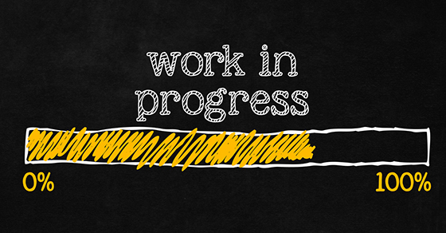

# 2D Car Racing Game in Unity
I worked on a 2D Car Racing Game in Unity using Csharpe. Basically, there are two cars: the car controlled by the user and the CPU car. They race continuously; If the user car wins, the race resets, and the user gets a point, but if the CPU car wins, the game ends, and the user's final score is the number of points they have.

| **Engineer** | **School** | **Area of Interest** | **Grade** |
|:--:|:--:|:--:|:--:|
| Sidarth R | Irvington High School | Engineering | Incoming Junior

# Final Presentation
Below is my final presentation on this project. I demoed my final project, and mentioned some of the reflections I had after doing this project
  
  
  
# Final Milestone - Score, Game Over Screen, Finishing Touches
After finishing the second milestone, the movement of the car, that biggest part of the project was completed. The final part of the game is mainly about the UI: the score and the game-over menu. I added the score using the text element from Unity. I added the game-over menu using a separate canvas that would appear depending on whether the game ended or not.   

[

# Second Milestone - Movement of the Car
After finishing the visuals tof the car, my next step was to code. I decided to start my code by coding the movement of the cars, as it is necessary for implementing the other parts of the game. The movement of the usercar is controlled by the arrow keys. The movement of the CPU Car is coded by an incremented variable, that can be checked in a conditional statement in order to change the CPU car's direction. 

# First Milestone - Visuals of Main Scene
  
My first milestone was to make all the visuals for the main scene of the game: the race. I downloaded multiple images and sprites from google and the Unity Assets Store respectively. I then imported them to my unity project and dragged them into the scene. I then placed them in the areas they belonged in. This milestone can be broken up into 4 parts: the track, the cars on the track, the background, and the parking lot. The track is located on the right, and it is where the race occurs. It is a rectangular track made up of a collection of straight roads. There are also the two cars on the track that are going to race. The first one is a racing car, which represents the car the user will control. The second one is a convertible, which is the car controlled by the computer. The third part is the solid green background. I added it in to represent grass, as many races are held outdoors. Finally, as a bit of an easter egg, I added a parking lot to the game. Normally in races, parking lots exist as there are many other people trying to watch and/or race. Hence, I added a parking lot to make the game more realistic.   

{:target="_blank" rel="noopener"}

# Code

**The code used for this game consists of 2 files: a CPU Car file, and a User Car file. Look a comments to see how they how they work:**

The code below is the CPU code.

The code below is the User code.

# Errors

Here are some of the major bugs/errors/barriers I ran into:

**1. Installing Unity**

I was able to successfully install Unity Hub when starting this project. I used the Unity website to complete the hub installation. Once I opened Unity hub, I followed the instructions provided and created my installation of Unity. I then attempted to create and open a new project using a hub. However, I kept seeing this error message:

I was eventually able to figure out that the first problem was that I was using the wrong path. I should have used /Applications/project_name as my path, but instead I was using documents/project_name. This is because my Unity is located in Applications. However, the bug was still there. After much debugging, I decided to try and re-install Unity, as the initial install may have been corrupted. This worked, and I was finally able to start on my game!

**2. Bug When Implenting AI into CPU Car Behavior**

In order to make the CPU Car move around the track, I had to implement an AI into the computer so it knew where it was going.

I figured that I had to set up a waypoint system. I followed many tutorials online, but ran into an imnumerable amount of errors. The most notable of these errors came when I was trying to give the car a vector to go to its next waypoint. The error kept saying that I could not convert from 'Vector3' to an 'integer'. I had to rewrite my line of code inorder to fix this issue. I changed it to: m_CompVector = waypoints[index].transform.position - transform.position. This ended up fixing the issue. 

# Reflection

Here, I will reflect on what I learnt about engineering and my thoughts on game development as a future career path. I learnt a lot about Engineering from my experiences with this project. From experiencing numerous bugs, I learnt that engineering is a process, and sometimes in engineering, things will go wrong. In these situations, it is your job to persevere and fix the bug. As far as my opinions on game development, I overall enjoyed it. I learnt that it could be a possible career path for me, especially if I decide to pursue Software Engineering. Initially, before starting my project, I was a little bit worried about how I was going to develop a game. I saw a lot of options in the Unity UI, and was a bit intimidated at first. However, after tweaking with a few options and finishing the project, I started to really enjoy using Unity.

